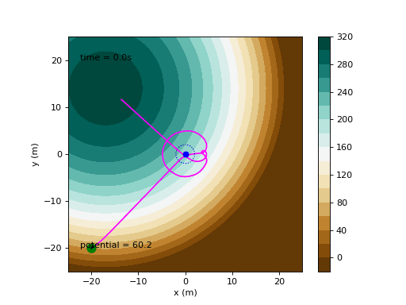

# Source-Finder

Une petite simulation d'un robot cherchant la source d'un polluant à partir d'un gradient (champ de potentiel).



## Description

Le projet simule un robot mobile qui se déplace dans un champ de potentiel représentant la concentration d'un polluant. Le robot effectue plusieurs comportements :

- Se rendre au centre de la zone d'étude
- Effectuer un échantillonnage en cercle pour détecter des gradients
- Estimer la direction/position de la source
- Approcher la source, la contourner puis estimer son centre
- Retourner au point de départ

L'animation montre la trajectoire du robot et la valeur du potentiel mesurée en temps réel.
La difficulté peut être ajustée dans `Code/RobotNavPot.py` en modifiant 
```python
 pot = Potential.Potential(difficulty=1, random=True) # ligne 24
```

## Contenu du dépôt

- `Code/Potential.py` : définition du champ de potentiel (pollution) et méthodes associées.
- `Code/Robot.py` : définition du robot, gestion des waypoints (WPManager) et simulation (RobotSimulation).
- `Code/RobotNavPot.py` : script principal de la simulation et de l'animation (exécutable). C'est ici que sont définis la logique d'état, la boucle de simulation et la génération de l'animation.
- `Code/Timer.py` : utilitaire de temporisation pour boucles de contrôle.

## Prérequis

- Python 3.8+ installé
- Paquets Python : numpy, matplotlib
- Pour générer ou sauvegarder la GIF depuis la simulation : pillow

Installation minimale des dépendances :

```powershell
python -m pip install --user numpy matplotlib pillow
```

## Lancer la simulation

1. Ouvrir un terminal (PowerShell) et se placer à la racine du dépôt :

```powershell
cd Path\To\Source-Finder\Code
```

2. Lancer le script d'animation :

```powershell
python RobotNavPot.py
```

L'animation ainsi que les données des coordonnées et angle du robot, et le potentiel s'affichent via matplotlib.

Bonne exploration !
